<p align="center">
  
</p>

# FlowSense AI — AI Traffic Intelligence & Intervention Simulator

NeuraX Hackathon 3.0 · Domain 1 (AI in Smart Cities) · *Urban Traffic Flow & Incident Intelligence*

Team Members:
Narra Jaswanth
Nagineni Pravalika
Darakatla avanthi
Devarakonda sucharitha

FlowSense AI is a decision-support system for a Hyderabad-area urban road network. It answers, from data available at the moment of the question:

**what is happening now → what caused it → what happens next → where it spreads → what we can do → what happens if we do it → which option simulates better → why to trust it.**

It is advisory and simulation-only: no live signal control, cameras, GPS, navigation, or municipal integration. It needs **no API keys**.

## What it does

| Stage | How | Output |
|---|---|---|
| Observe | Sanitize the 5-min sensor grid (dedupe, sort, reject negatives, spikes and stuck sensors, fill ≤15 min) | Per-segment state + data-quality score |
| Detect | Local speed-ratio drop vs. a segment × hour × day-type baseline, minus the network-wide shift. An **epicentre rule** flags only the source, not its spillback neighbors | Anomaly score, confidence, NORMAL / MODERATE / HEAVY / CRITICAL |
| Diagnose | Transparent rules: onset abruptness, roadworks active at t, rain / event / network shift, independently detected bottlenecks, neighbor drops | Transient incident, recurring bottleneck, weather/event, roadwork, propagated congestion, normal, or unknown |
| Forecast | LightGBM per metric × horizon on Δ(target − now), with a persistence baseline and residual P10–P90 bands | Speed, flow and congestion at +15/30/45/60 min |
| Propagate | Explicit hop-decay × load model on the grid, calibrated from training incidents (no GNN) | At-risk neighbors, impact level, ETA |
| Recommend | Organizer planning candidates: direct, then graph neighbors within 2 hops, then operational-only fallback. Feasibility checks (signals, exits, bands) | Ranked, feasible candidates |
| Simulate | Static user equilibrium (BPR + Webster signal delay, Frank-Wolfe) on a turn-restriction-aware line graph, pivoted on observed flows | Baseline vs counterfactual |
| Compare | Absolute and % KPI change, improved and worsened segments, side effects, solver-tolerance flag | Before/after impact, labelled *simulated* |
| Explain | Structured evidence objects (value, baseline, Δ, threshold, source) behind every conclusion | Operator advisory with reasons, confidence, limitations |
| Evaluate | Held-out validation, benchmark, synthetic robustness and simulation checks, kept in separate categories | [`docs/EVALUATION_REPORT.md`](docs/EVALUATION_REPORT.md), [`docs/ROBUSTNESS_REPORT.md`](docs/ROBUSTNESS_REPORT.md) |

Headline measured results, on held-out validation unless stated (full tables in [`docs/EVALUATION_REPORT.md`](docs/EVALUATION_REPORT.md)):
- **Forecasting:** beats persistence on all 12 targets. Flow MAE improves 27–36%, speed 3–19%, congestion 5–17%, with the larger gains at longer horizons.
- **Detection:** all 11 validation incidents detected, median delay 2 min, slot-level F1 0.71.
- **Propagation:** neighbor hit rate 91% against a 19% control base rate.
- **Robustness:** with 5% combined injected noise, the sanitized pipeline keeps detection F1 at 0.87. Without sanitizing it falls to 0.01.
- **Incident type:** *not* reliably inferable from traffic. On validation the type classifier does not beat chance, so the UI shows type as low-confidence.

## Tech stack

| Layer | Technology | Why this choice |
|---|---|---|
| Language (backend) | Python 3.11 | Standard data/ML ecosystem |
| API | FastAPI 0.141 + Pydantic 2 + Uvicorn | Typed request/response models, automatic OpenAPI docs at `/docs` |
| Storage | DuckDB 1.5 (embedded) + Parquet (PyArrow) | Analytical workload with a single reader: no server, no credentials, fast columnar queries over 2.4M rows |
| Data processing | pandas 3, NumPy 2 | Vectorized (segment × time) grid operations; no Python loops over rows |
| Forecasting | LightGBM 4.7 (12 models) | Tabular lag features and 15 training days: gradient boosting fits the data; an LSTM or transformer isn't justified |
| Detection / diagnosis | Statistical baseline (median/MAD) + transparent rules | Only 49 labeled incidents, too few for a trained classifier; rules are explainable |
| Graph | NetworkX 3.6 + SciPy sparse Dijkstra | Regular 12×10 grid: explicit propagation instead of a GNN; the turn-aware line graph enforces restrictions as transitions |
| Simulation | NumPy/SciPy: BPR volume-delay + Webster signal delay, Frank-Wolfe equilibrium | Standard, transparent traffic-assignment method; no black box |
| Metrics / utilities | scikit-learn 1.9, joblib | AUC and metrics; model persistence |
| Frontend | React 19 + TypeScript 6 + Vite 8 | Typed components, fast dev server with an `/api` proxy |
| Styling | Tailwind CSS 4 (design tokens in `styles/index.css`) | One consistent visual system; traffic colors are semantic tokens |
| Server state | TanStack Query 5 | Caching per simulation time and segment; loading and error states |
| Routing | React Router 7 | Simulation time and selected segment live in the URL (`?t=&seg=`) |
| Rider services | Nominatim, OSRM / OpenRouteService, Overpass | Backend adapters, keyless by default, no keys in the browser |
| Maps | Leaflet 1.9 + React-Leaflet 5 + OpenStreetMap tiles | No API key; the 436-segment network is one canvas layer drawn once, and only significant segments are drawn above it in ordered panes |
| Charts | Recharts 3 | Forecast bands, metric comparisons |
| Icons | Lucide | One consistent icon family |
| Authentication | Built-in: FastAPI + HMAC-signed HttpOnly session cookie (Python standard library) | Closed demo with one account: no auth provider, no new dependency, token never readable by page scripts |
| Testing | pytest 9 (109 tests), Vitest 5 + Testing Library (68 tests) | Leakage, validity, simulation, API, authentication and UI logic |
| Packaging | Docker + docker-compose (nginx serves the UI and proxies `/api`) | Reproducible deployment; data mounted, not baked in |

**External services: none.** No LLM, map, weather, traffic, database, auth provider or storage API. Everything runs on one machine from the organizer dataset.

## Architecture

```mermaid
flowchart LR
  subgraph DATA["Data layer (offline)"]
    RAW["raw/*.csv<br/>organizer data, immutable<br/>SHA-256 snapshot"] --> PQ["processed/*.parquet"] --> DB[("neurax.duckdb")]
    DB --> SAN["sanitize()<br/>dedupe · sort · negatives · spikes<br/>stuck sensors · gaps"] --> PANEL["Panel cache<br/>436 segments × 5-min grid"]
  end

  subgraph TRAIN["Training & evaluation (offline, scripts/)"]
    PANEL --> FIT["train_models.py<br/>detector baseline + threshold<br/>bottlenecks · propagation calibration<br/>12 LightGBM forecasters"]
    PANEL --> EVAL["evaluate_models.py · run_robustness.py<br/>forecast_targets used ONLY here, as labels"]
    FIT --> ART[("artifacts/<br/>models · metadata · metrics")]
    EVAL --> ART
  end

  subgraph RUNTIME["Runtime: engine.Snapshot(t), data ≤ t only"]
    PANEL --> OBS["Observe<br/>state + data quality"] --> DET["Detect<br/>epicentre anomaly score"] --> DIA["Diagnose<br/>rule-based cause"]
    DIA --> FC["Forecast<br/>+15…+60 min, P10–P90"] --> PROP["Propagate<br/>hop decay × load"]
    PROP --> REC["Recommend<br/>direct → neighbors → operational<br/>feasibility checks"] --> SIM["Simulate<br/>Frank-Wolfe on turn-aware line graph<br/>pivot on observed flows"]
    SIM --> CMP["Compare<br/>before/after KPIs · side effects"] --> EXP["Explain<br/>evidence · confidence · limitations"]
    ART -.-> DET & FC & PROP
  end

  EXP --> API["FastAPI<br/>operator, rider and corridor REST endpoints"] --> UI["React console<br/>8 operator pages + public rider portal · Leaflet map"]
```



**How a request flows.**
1. The UI calls, for example, `GET /api/traffic/current?t=2026-01-16T13:30`.
2. `engine.get(t)` floors t to the 5-minute grid, checks the data range, and slices the cached panel to the 300 readings ending at t, so nothing after t is visible.
3. It then scores anomalies, runs all 12 forecasters for every segment, and caches the snapshot. The first snapshot takes about 3 s, later ones about 1 s.
4. `GET /api/recommendations/{segment}` adds a cached reference equilibrium plus one Frank-Wolfe run per feasible candidate (up to 6). That takes about 10–20 s the first time and is cached afterwards.

**Backend modules (`backend/app/`).**

| Module | Responsibility |
|---|---|
| `config.py` | Paths, `.env` loading, every tunable constant (tagged [DESIGN] or [INF]) |
| `data.py` | Read-only DuckDB access, sanitizer, panel cache, quality score, active roadworks (`start ≤ t < end`) |
| `features.py` | 60 leakage-safe features (backward shifts only); `future()` builds training labels |
| `detection.py` | Baseline, anomaly score, traffic state, diagnosis, type likelihood, recurring-bottleneck detector, evidence objects |
| `forecasting.py` | 12 LightGBM models, residual bands, feature-schema check on load |
| `graph.py` | Node graph, neighbors, turn-restricted line graph, legal detours, GeoJSON |
| `propagation.py` | Calibrated spillback model and its indirect evaluation |
| `simulation.py` | BPR + Webster, Frank-Wolfe, pivot-point scenarios, before/after with solver tolerance |
| `recommendations.py` | Candidate search, feasibility, simulate-and-rank, operator advisory |
| `engine.py` | Snapshot at time t (LRU-cached) |
| `evaluation.py`, `robustness.py` | Metrics and the synthetic corruption harness |
| `auth.py` | Login check (constant-time), signed session tokens, session user |
| `api.py` | REST endpoints (see [`docs/API.md`](docs/API.md)), plus the single auth middleware guarding every `/api/*` data route |

**Key design decisions.**
- **Causal by construction.** Features are built on a complete time grid using backward shifts only. A test rewrites the future and checks the features at t are unchanged.
- **Labels stay out of runtime.** Incident labels, `scenario_examples`, `structural_bottleneck` and its proxy `peak_capacity_factor` are never read by the live pipeline; tests enforce this.
- **Pivot-point simulation.** The static OD table reproduces observed flows poorly, so the model supplies only the change and the level comes from sensors at t.
- **Simple, explainable models.** The data doesn't justify a GNN, LSTM or learned recommender, so there are none.
- **Frontend state lives in the URL,** so every page, link and reload agree on the time and segment.

Deeper detail: [`docs/ARCHITECTURE.md`](docs/ARCHITECTURE.md) (modules and data flow), [`docs/MODEL_CARD.md`](docs/MODEL_CARD.md) (models and results), [`docs/API.md`](docs/API.md) (endpoints).

## Repository layout

```
backend/
  app/            config, data (DuckDB + sanitizer), features, detection, forecasting, graph,
                  propagation, simulation, recommendations, engine, evaluation, robustness, api,
                  rider portal: user_api, user_traffic, user_explain, providers;
                  corridor analysis: corridor, corridor_api, corridor_config.json;
                  infrastructure recommendation: infrastructure, infrastructure_config.json
  scripts/        ingest_data, validate_data, build_features, build_network, train_models,
                  evaluate_models, run_robustness  (+ the original data-layer scripts)
  tests/          pytest: leakage, validity, sanitizer, API
  data/           raw/ (immutable organizer CSVs), processed/, db/, features/, metadata/, validated/
  artifacts/      models/ (joblib), metrics/ (*.json), metadata/ (calibrations, checksums, GeoJSON)
frontend/         React + TypeScript + Vite + Tailwind + TanStack Query + React Router + Recharts + React-Leaflet
                  (src/components/TrafficMap.tsx + src/utils/mapStyles.ts = map layers, camera and visual hierarchy;
                  SegmentCard.tsx = floating segment card; MapLegend.tsx = shared legend;
                  pages/UserPortal.tsx + components/user/* = public rider portal at /user)
.env / .env.example   optional config for backend and frontend (no secrets)
docker-compose.yml    backend + frontend containers (data and artifacts mounted)
docs:             IMPLEMENTATION_PLAN, ARCHITECTURE, MODEL_CARD, API, EVALUATION_REPORT, ROBUSTNESS_REPORT,
                  BUILD_COMPLETION_REPORT, FINAL_DEMO_CHECKLIST, RESEARCH, DATASET_INTELLIGENCE_REPORT, USER_PORTAL, TRAFFIC_CORRIDOR_ANALYSIS, INFRASTRUCTURE_RECOMMENDATION
skills/           unrelated vendored reference repo (gitignored)
```

## Setup

Requirements: Python 3.11+, Node 20+ (tested with 24).

```bash
pip install -r backend/requirements.txt
cd frontend && npm install && cd ..
```

Put the organizer CSVs in `backend/data/raw/` (never edited afterwards).

Optionally create the environment file. The app runs without one, and it holds no secrets:

```bash
cp .env.example .env      # then adjust values if needed (see "Environment variables")
```

### Data preparation → training → evaluation (run once, from `backend/`)

```bash
cd backend
python scripts/ingest_data.py          # raw CSV -> Parquet -> DuckDB -> parity check
python scripts/validate_data.py        # relational/sanity checks + SHA-256 snapshot of raw files
python scripts/build_features.py       # sanitized panel cache (data/features/panel_full.npz)
python scripts/build_network.py        # GeoJSON + graph summary
python scripts/train_models.py         # detector, bottlenecks, propagation, 12 forecasters (~3 min)
python scripts/evaluate_models.py      # -> artifacts/metrics/*.json + docs/EVALUATION_REPORT.md (~4 min)
python scripts/run_robustness.py       # -> robustness_metrics.json + docs/ROBUSTNESS_REPORT.md (~3 min)
```

Every script is idempotent. `validate_data.py` (without `--refresh-checksums`) exits non-zero if any raw file changed.

### Run

```bash
# terminal 1 (from backend/)
python -m uvicorn app.api:app --port 8000        # API 
# terminal 2 (from frontend/)
npm run dev                                       # UI: 
```

The UI opens at the demo time, 2026-01-16 13:30, during a held-out validation incident on R0360. Sign in first (see [Authentication](#authentication)). Use the clock in the top bar to move through time. [`docs/FINAL_DEMO_CHECKLIST.md`](docs/FINAL_DEMO_CHECKLIST.md) has a 4-minute walkthrough.

### Using the app

| Page | What it shows |
|---|---|
| Dashboard | Traffic-state map, detected events, context (rain / event / holiday), and a segment drill-down: anomaly, diagnosis, evidence, forecast, propagation, intervention |
| Incidents | Detected events (never the labels) with a Normal → Anomaly → Incident-like → Forecast → Propagation → Recommendation timeline |
| Forecast | +15…+60 min forecast with a P10–P90 band. A separate, visibly striped **Backtest** mode overlays recorded future values |
| Propagation | Source segment and at-risk neighbors for a +15/30/45/60 min horizon |
| Interventions | Ranked planning candidates (direct → neighbors → operational fallback), feasibility checks, legal diversion, advisory with reasons and limitations. Every action is labelled **Simulate**, never "Apply" |
| Infrastructure | Corridor between any two points: bottleneck zones, flyover candidate with start/end, intervention comparison, simulated land evaluation, recommendation and simulated impact (**simulation / demo data**; see below) |
| Simulation | Baseline vs counterfactual maps side by side, KPI table (absolute and %), improved/worsened segments, solver-tolerance note |
| Evaluation | Validation, Benchmark, Synthetic-robustness and Simulation-estimate results, kept in separate labelled sections |

**Map design.** The real-world OpenStreetMap basemap is the primary layer; the organizer network is a synthetic 12×10 grid placed on Hyderabad coordinates, so it is drawn as a faint *Traffic Simulation Network* overlay and never presented as real roads. What the map emphasizes is the traffic event.
- **Basemap:** standard OSM tiles recolored in CSS to a pale, road-first look, so street names and neighborhoods stay readable. No API key, no satellite, no dark theme.
- **Faint network:** all 436 segments are drawn once as a single canvas layer at very low opacity, quieter still when zoomed in on real streets. Hovering shows a segment's speed, flow, congestion, queue, delay and anomaly score, and clicking selects it. It can be hidden entirely.
- **Problems first:** only non-normal segments are drawn above the network. Moderate is thin amber, heavy is orange, and critical is the widest red. White casings keep them legible over streets.
- **Incident marker:** small and scaled by severity. Only a critical incident pulses, with one slow ring.
- **Camera:** selecting a segment flies smoothly to a road-level frame of the segment and its immediate neighbors, with margins that leave room for the floating card. Turning on propagation frames the source and its at-risk neighbors, and a simulation run frames the target plus the improved and worsened segments. The camera moves only on those events, never when the clock or forecast horizon changes.
- **Zoom behavior:** controlled wheel and trackpad zoom, and half-step buttons. Full-page maps zoom at once. Embedded maps (Interventions, Simulation) zoom only after you click into them, so the page keeps scrolling normally.
- **Forecast mode (Dashboard):** *Current · +15 · +30 · +45 · +60*. Each horizon colors every segment by its model-forecast traffic state (from `GET /api/forecast-map`) and eases between horizons. Segments that are normal now but forecast to degrade are dashed ("predicted impact"). This shows what the forecast model predicts, so any spread beyond one hop is not invented; calibration found spillback in this data to be one hop deep.
- **Propagation:** the source is red and affected neighbors orange (high risk) or amber (lower risk). Only these paths animate, with marching dashes and a time-to-impact label ("5m") on first-hop neighbors.
- **Segment card:** a compact floating card with the segment ID, cause, confidence, speed and forecast trend ("Recovering by +30 min"), plus source and target nodes and the segment's midpoint coordinates from the dataset. It reuses the side panel's queries, so it adds no requests.
- **Street names are never invented.** Segments are synthetic, so no street name is shown for them: read street and area names from the basemap around the corridor. Reverse geocoding was deliberately not added, because it would attach a real street name to a segment that isn't on it.
- **Simulation:** baseline and counterfactual maps sit side by side and stay synced. The counterfactual defaults to a *change* view where only segments whose travel time moved by more than 1% are colored (teal improved, rust worsened), and each map carries a "SIMULATION ESTIMATE" tag. Unaffected congestion is drawn only as faint context.
- A Layers menu toggles traffic state, the simulation network, propagation and incidents. A compact legend (Traffic · FlowSense · Simulation) collapses on small maps.

Docker (not tested in the build environment, which had no Docker): run the pipeline once on the host, then `docker compose up --build`. The UI is at :8080 and the API at :8000. Data and artifacts are mounted, not baked into the images.

## Infrastructure analysis (operator)

The **Infrastructure** page (`/flyover`) has two parts that share one map: a corridor / flyover candidate analysis, and an AI infrastructure recommendation built on it.

### Flyover candidate analysis

This part analyses a corridor between any two points in Hyderabad: real road route, ~300 m segments, congestion and bottleneck scores per segment, candidate zones with optimised start/end points, a 0-100 suitability indicator with breakdown, reasons built from the actual values, alternatives to weigh first (signals, junction redesign, lanes, diversion, underpass) and a data-confidence indicator. It is a planning aid, **not engineering approval**, and it runs on **simulation data** (the organizer dataset matched approximately to real roads), labelled as such everywhere. Missing fields are shown as *Data unavailable*, never invented.

- **Run:** operator login, then **Infrastructure** in the header. Set origin and destination (search or pick on the map), press **Run Corridor Analysis**.
- **Code:** `backend/app/corridor.py` (engine), `corridor_api.py` (routes), `corridor_config.json` (all weights and thresholds), `scripts/build_corridor_features.py` (precompute + benchmark), `scripts/inspect_dataset.py` (inspect a new dataset), `frontend/src/pages/Flyover.tsx`.
- **API** (operator session): `POST /api/corridor/analyze`, `GET /api/corridor/{id}[/segments|/bottlenecks|/candidates]`, `POST /api/flyover/analyze`, `GET /api/flyover/model-info`, `POST /api/traffic/predict`.
- **Env:** `CORRIDOR_TRAFFIC_PROVIDER` (default `dataset`), `CORRIDOR_CONFIG_PATH`.
- Algorithm, data sources, models, dataset format, confidence and limitations: [`docs/TRAFFIC_CORRIDOR_ANALYSIS.md`](docs/TRAFFIC_CORRIDOR_ANALYSIS.md).

### AI infrastructure recommendation (operator)

The same **Infrastructure** page compares a flyover, road extension, road widening, junction redesign, signal optimization and traffic diversion for the bottleneck zone, then recommends one, shows a land and construction feasibility card, a data-confidence card and a **Simulate Intervention** current-vs-after view. **Land, cost and impact figures are simulation / demo data** (labelled on every card): the land layer is a deterministic simulated provider, impacts come from a BPR model on the zone's measured utilisation. Swap in real GIS data through the `InfrastructureDataProvider` seam. API: `POST /api/infrastructure/analyze`, `POST /api/infrastructure/simulate`. Env: `INFRASTRUCTURE_PROVIDER`, `INFRASTRUCTURE_CONFIG_PATH`. Details: [`docs/INFRASTRUCTURE_RECOMMENDATION.md`](docs/INFRASTRUCTURE_RECOMMENDATION.md).

## User portal

A second, public experience for riders lives at **`/user`** (press **USER LOGIN** on the operator login page). It is map-first: search a destination, get ranked route options with simulated traffic, an *estimated*-saving diversion recommendation when the usual route is congested, and nearby hospitals, fuel, food, bus, metro and parking.

- **Routes:** `/user` (public) and `/login` → `/dashboard` (operator, unchanged).
- **Traffic is the FlowSense dataset replay, labelled "Simulated traffic".** No live traffic source is connected and the synthetic grid is never drawn on the rider map.
- **Providers (OpenStreetMap-based, backend only):** Nominatim (search), the OSRM demo server (routing; OpenRouteService instead when `OPENROUTESERVICE_API_KEY` is set), Overpass (nearby places). No weather API.
- **Public API:** `/api/user/*` only, with validation and per-IP rate limits. Operator APIs still need the operator session.
- **Env vars:** all optional, listed below and in `.env.example`.
- **Limitations:** simulated traffic approximated onto real roads, no turn-by-turn, public demo providers can be slow, ORS untested live.

Details, ranking formula and security notes: [`docs/USER_PORTAL.md`](docs/USER_PORTAL.md).

### Rider traffic explanation and logout

Congested roads on the rider map can be explained: **Why is traffic heavy?** shows FlowSense's likely cause (marked Reported / Likely / Possible / Unknown, never a confirmed accident), its evidence, a +15/+30/+60 min forecast with confidence, and an estimated alternative route. It reuses the operator diagnosis engine through `POST /api/user/explain`. **Log out** on the rider screen revokes any FlowSense session and returns to `/login`.

## Authentication

FlowSense AI is a closed internal/demo application behind a **Login ID + password** gate. There is no sign-up, password recovery, social login or OAuth.

**Demo credentials:**

| Login ID | Password |
|---|---|
| `tgpolice` | `tgpolice` |

This is a demo/internal authentication mechanism with one shared account. Change the credentials (see [Environment variables](#environment-variables)) before sharing a deployment.

**How it works:**
1. `/login` posts the credentials to `POST /api/auth/login`. The server compares them in constant time against `FLOWSENSE_LOGIN_ID` / `FLOWSENSE_LOGIN_PASSWORD`.
2. On success the server sets an **HttpOnly, SameSite=Lax session cookie** carrying HMAC-SHA256-signed claims (user and expiry, 12 h by default). The password is never stored in the cookie, returned in a response or logged, and page JavaScript can't read the cookie.
3. One backend middleware protects **every** `/api/*` route except `/api/health` and `/api/auth/*`. Without a valid, unexpired cookie the response is `401`.
4. In the frontend, one `AuthProvider` / `useAuth()` holds `currentUser`, `isAuthenticated`, `isLoading`, `login()` and `logout()`, restored from `GET /api/auth/me` on page load. A single `RequireAuth` route guard wraps all pages, and signed-out visitors go to `/login` and back to the page they wanted after signing in. Any `401` from a data call (an expired session) signs the UI out centrally.
5. **Logout** (top-right of the operator header, and **Log out** on the rider screen) calls `POST /api/auth/logout`, which clears the cookie, **revokes the token server-side**, drops all cached data and returns to `/login`.

**Error handling:** a wrong login ID or password gives the same message, *"Invalid login ID or password."*, so it never reveals which field was wrong. Empty fields are validated inline. A network failure shows *"Unable to sign in right now. Please try again."* Malformed login requests get a `422` that never echoes the submitted values.

**Routes:** `/login` and the rider portal `/user` are public. `/dashboard`, `/incidents`, `/forecast`, `/propagation`, `/interventions`, `/flyover` (Infrastructure), `/simulation` and `/evaluation` require a session, and `/` redirects to `/dashboard`.

**Known limitations of this demo design:**
- There is a single shared account and no login throttling.
- Logout revokes the token, but the revocation list is in memory: it is per process and cleared on restart. Use a shared store for several workers.
- If `FLOWSENSE_SESSION_SECRET` is unset, a random secret is generated at startup and everyone is signed out whenever the API restarts.

For real multi-user use, add per-user accounts with hashed passwords, a shared session store, and login rate limiting.

## Leakage prevention

- `forecast_targets_*` are read **only** by evaluation code, as ground truth. Training labels are built by shifting `traffic_train` forward inside `features.future()`, which feature code never calls.
- All features are backward shifts or trailing windows on a complete 5-min grid. A test rewrites the future and proves the features at t are unchanged.
- Runtime detection reads traffic and context at ≤ t only. A test makes any read of incident labels or scenarios fail. Roadworks count only while `start ≤ t < end`.
- `event_id` is never used. `event_level > 0` is used only as an "event present" flag.
- `scenario_examples.csv` is a demo template only (it duplicates `incidents_train`). A test checks the evaluation code never reads it.
- The recurring-bottleneck detector never reads `structural_bottleneck` or `peak_capacity_factor`. The latter was found to be a perfect proxy for the flag. The API hides both.
- The UI's LIVE mode never shows future values. The Forecast page's BACKTEST mode is visibly separate.

## Testing

```bash
cd backend && python -m pytest -q          # 109 tests (incl. 14 authentication, 34 rider portal, 18 corridor, 15 infrastructure)
cd frontend && npm test                     # 68 tests (vitest, incl. 9 login, 10 map, 28 rider portal, 13 flyover/infrastructure)
cd frontend && npm run build                # type-check + production build
```

## Environment variables

There is one `.env` at the repo root, and git ignores it. `backend/app/config.py` reads it using only the standard library, and Vite reads it through `envDir: '..'`.
- Real environment variables override the file, and blank values fall back to the defaults.
- Relative paths are resolved from the repo root.
- Every variable is optional. **No API keys are needed:** maps use OpenStreetMap, traffic and weather come from the dataset, storage is embedded DuckDB, login is built in (no auth provider), and there is no LLM. Explanations are deterministic templates over computed evidence.

| Variable | Side | Default | Purpose |
|---|---|---|---|
| `DATA_DIR` | backend | `backend/data` | Raw, processed, db and features folders |
| `NEURAX_DB_PATH` | backend | `$DATA_DIR/db/neurax.duckdb` | DuckDB file |
| `MODEL_DIR` | backend | `backend/artifacts` | Models, metrics, metadata |
| `CORS_ALLOWED_ORIGINS` | backend | `http://localhost:5173,http://127.0.0.1:5173` | Browser origins allowed to call the API (set to the deployed UI URL) |
| `DEMO_TIME` | backend | `2026-01-16 13:30:00` | Simulation clock on first load |
| `FLOWSENSE_LOGIN_ID` | backend | `tgpolice` | Login ID for the single demo account |
| `FLOWSENSE_LOGIN_PASSWORD` | backend | `tgpolice` | Its password (server-side only; never sent to the browser) |
| `FLOWSENSE_DISPLAY_NAME` | backend | `TG Police` | Name shown in the header after sign-in |
| `FLOWSENSE_SESSION_SECRET` | backend | random per API start | HMAC key signing session cookies. Set a stable value so sessions survive restarts: `python -c "import secrets;print(secrets.token_hex(32))"` |
| `FLOWSENSE_SESSION_TTL_HOURS` | backend | `12` | Session lifetime |
| `FLOWSENSE_COOKIE_SECURE` | backend | `false` | `true` when served over HTTPS (adds the cookie's Secure flag) |
| `ROUTING_PROVIDER` | backend | `auto` | `auto` (ORS if a key is set, else OSRM), `osrm` or `openrouteservice` |
| `OPENROUTESERVICE_API_KEY` | backend, **secret** | empty | Optional ORS key for rider routing |
| `OSRM_URL`, `OPENROUTESERVICE_URL`, `GEOCODING_URL`, `OVERPASS_URL` | backend | public demo servers | Point at self-hosted or paid providers |
| `NOMINATIM_USER_AGENT` | backend | `FlowSenseAI/1.0 (hackathon demo)` | Identifying User-Agent (Nominatim policy) |
| `CORRIDOR_TRAFFIC_PROVIDER` | backend | `dataset` | Traffic source for the corridor analysis (`dataset` = historical panel + simulation replay). A live provider plugs in via `TrafficDataProvider` |
| `INFRASTRUCTURE_PROVIDER` | backend | `simulation` | Land/infrastructure data source (`simulation` = SIMULATED demo layer). A GIS provider plugs in via `InfrastructureDataProvider` |
| `INFRASTRUCTURE_CONFIG_PATH` | backend | bundled `infrastructure_config.json` | Alternative effect sizes, unit costs and weights (demo assumptions) |
| `CORRIDOR_CONFIG_PATH` | backend | bundled `corridor_config.json` | Alternative weights/thresholds file |
| `VITE_API_BASE_URL` | frontend, **public** | empty (same origin; dev proxies `/api` to :8000) | Backend URL when UI and API are on different hosts |
| `VITE_TILE_URL` | frontend, **public** | `https://tile.openstreetmap.org/{z}/{x}/{y}.png` | Basemap tiles. The public OSM server suits demos; use a hosted provider for heavy traffic |

`VITE_*` values are bundled into the browser, so never put a secret in them. The `FLOWSENSE_*` auth values are server-side only and must never be given a `VITE_` prefix. Hosting-platform credentials (Vercel, Railway and so on) are deployment logins and don't belong in `.env`. Restart the API after editing `.env`; Vite restarts itself.

## Known limitations

- **Infrastructure recommendation:** land, cost and impact are simulation / demo data and the intervention effects are macroscopic-model assumptions, not engineering estimates; the card is on the Infrastructure page, not the Dashboard's right panel. See `docs/INFRASTRUCTURE_RECOMMENDATION.md`.
- **Flyover analysis:** simulated traffic matched approximately to real roads (coverage shown per run); scores are transparent indicators that cannot be validated as accuracy (benchmark ROC-AUC 0.71: weak); no pedestrian, transit, road-width or feasibility data; analyses are kept in memory. See `docs/TRAFFIC_CORRIDOR_ANALYSIS.md`.
- **Rider portal:** traffic is the simulated dataset replay, only approximately matched to real roads; there is no live traffic and no turn-by-turn. "Why is traffic heavy?" explains the nearest simulated segment and is an inference, never a confirmed incident. Public OSRM/Nominatim/Overpass servers are demo-grade. See [`docs/USER_PORTAL.md`](docs/USER_PORTAL.md).
- Incident **type** can't be inferred from these traffic signals. Severity, not type, drives the signature, and validation accuracy is below chance.
- At the pre-registered threshold the independent bottleneck detector finds only 2 of the 16 flagged segments (precision 1.0), although its ranking AUC is 0.97.
- Spillback in this data is one hop deep and immediate. Propagation validation is indirect, since there are no labeled spillback events.
- **Simulation:** the static OD table reproduces observed flows poorly (correlation ≈ 0.1–0.2), so scenarios are pivoted on observed flows. A single-segment change moves network totals by < 1%, usually within the solver tolerance, so the UI flags this and leads with local effects. There is no intervention ground truth (`intervention_reference.csv` is withheld).
- Every candidate type is modeled as its `capacity_delta_vph`. Time-window turn restrictions carry no times in the data, so they are enforced at peak hours as a design assumption.
- The labels appear incomplete [inference]. About 1,000 training slots show abrupt, local, incident-shaped drops with no label, so label-based precision is a lower bound.
- Recommendations take about 10–20 s to compute; results are cached.
